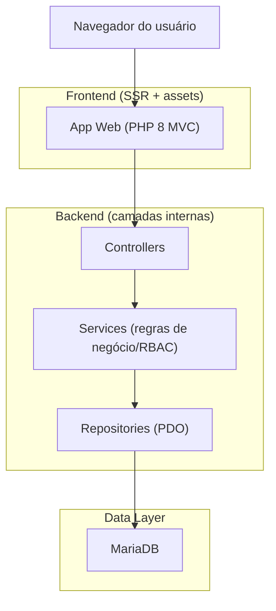
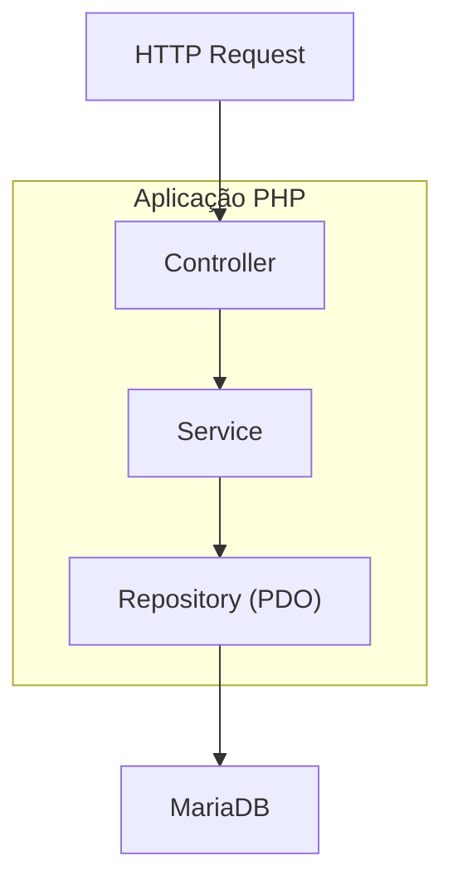
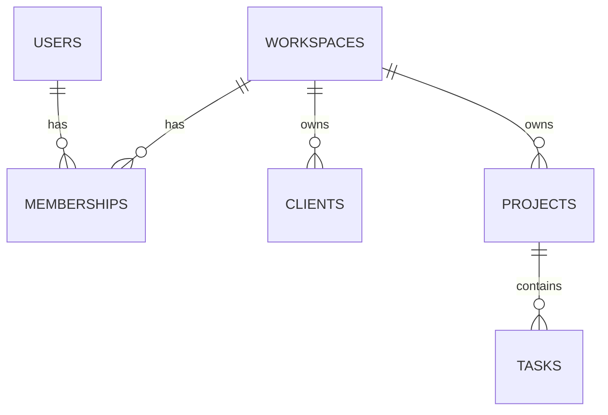

## 1.Architecture design


## 2.Technology Description
- Frontend: TailwindCSS + TypeScript (para interações e chamadas AJAX)
- Backend: PHP@8 (MVC) + Service + Repository + PDO
- Database: MariaDB

## 3.Route definitions
| Route | Purpose |
|-------|---------|
| /login | Autenticação e seleção/criação de workspace |
| /dashboard | KPIs e atalhos do workspace |
| /clientes | Lista/cadastro e detalhes de clientes |
| /projetos | Projetos e tarefas |
| /financeiro | Lançamentos e visão mensal |

## 4.API definitions (If it includes backend services)
### 4.1 Endpoints (JSON para UI dinâmica)
- GET /api/clientes
- POST /api/clientes
- GET /api/projetos
- POST /api/tarefas
- POST /api/financeiro/lancamentos

### 4.2 Tipos compartilhados (TypeScript)
```ts
type Role = "owner"|"manager"|"member"|"finance";
export type WorkspaceId = number;
export type Client = { id:number; workspace_id:WorkspaceId; name:string; status:"active"|"archived" };
```

## 5.Server architecture diagram (If it includes backend services)


## 6.Data model(if applicable)
### 6.1 Data model definition


### 6.2 Data Definition Language
```sql
CREATE TABLE users (id BIGINT UNSIGNED AUTO_INCREMENT PRIMARY KEY, email VARCHAR(255) NOT NULL UNIQUE, password_hash VARCHAR(255) NOT NULL, created_at DATETIME NOT NULL DEFAULT CURRENT_TIMESTAMP);
CREATE TABLE workspaces (id BIGINT UNSIGNED AUTO_INCREMENT PRIMARY KEY, name VARCHAR(120) NOT NULL, created_at DATETIME NOT NULL DEFAULT CURRENT_TIMESTAMP);
CREATE TABLE memberships (id BIGINT UNSIGNED AUTO_INCREMENT PRIMARY KEY, workspace_id BIGINT UNSIGNED NOT NULL, user_id BIGINT UNSIGNED NOT NULL, role ENUM('owner','manager','member','finance') NOT NULL, created_at DATETIME NOT NULL DEFAULT CURRENT_TIMESTAMP, INDEX(workspace_id), INDEX(user_id));
CREATE TABLE clients (id BIGINT UNSIGNED AUTO_INCREMENT PRIMARY KEY, workspace_id BIGINT UNSIGNED NOT NULL, name VARCHAR(200) NOT NULL, status ENUM('active','archived') NOT NULL DEFAULT 'active', created_at DATETIME NOT NULL DEFAULT CURRENT_TIMESTAMP, INDEX(workspace_id));
CREATE TABLE projects (id BIGINT UNSIGNED AUTO_INCREMENT PRIMARY KEY, workspace_id BIGINT UNSIGNED NOT NULL, client_id BIGINT UNSIGNED NULL, name VARCHAR(200) NOT NULL, status ENUM('active','archived') NOT NULL DEFAULT 'active', due_date DATE NULL, created_at DATETIME NOT NULL DEFAULT CURRENT_TIMESTAMP, INDEX(workspace_id), INDEX(client_id));
CREATE TABLE tasks (id BIGINT UNSIGNED AUTO_INCREMENT PRIMARY KEY, workspace_id BIGINT UNSIGNED NOT NULL, project_id BIGINT UNSIGNED NOT NULL, assignee_user_id BIGINT UNSIGNED NULL, title VARCHAR(255) NOT NULL, status ENUM('todo','doing','done') NOT NULL DEFAULT 'todo', due_date DATE NULL, created_at DATETIME NOT NULL DEFAULT CURRENT_TIMESTAMP, INDEX(workspace_id), INDEX(project_id));
CREATE TABLE financial_entries (id BIGINT UNSIGNED AUTO_INCREMENT PRIMARY KEY, workspace_id BIGINT UNSIGNED NOT NULL, client_id BIGINT UNSIGNED NULL, project_id BIGINT UNSIGNED NULL, type ENUM('income','expense') NOT NULL, category VARCHAR(120) NULL, amount DECIMAL(12,2) NOT NULL, entry_date DATE NOT NULL, note TEXT NULL, created_at DATETIME NOT NULL DEFAULT CURRENT_TIMESTAMP, INDEX(workspace_id), INDEX(entry_date));
```

Notas de segurança (essenciais)
- Auth: `password_hash`/`password_verify` + sessão PHP (cookie HttpOnly/SameSite).
- Multi-tenant: todas as queries filtram por `workspace_id` (garantido no Service/Repository).
- RBAC: checagem por `memberships.role` no Service antes de mutações/leitura sensível.