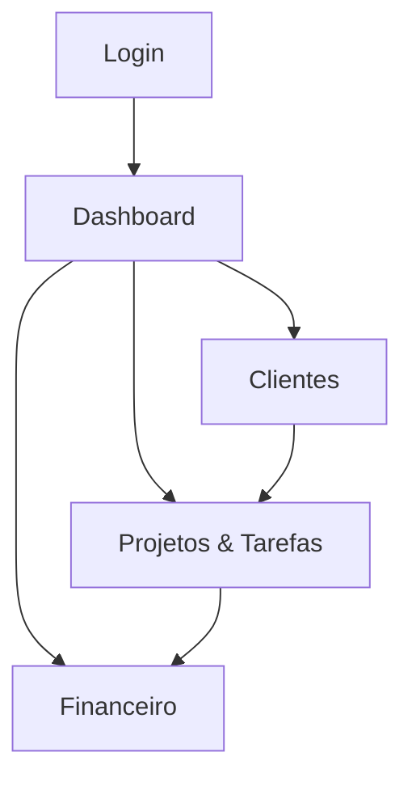

## 1. Product Overview
CRM SaaS multi-tenant para gerenciar clientes, projetos, tarefas e financeiro em um único lugar.
Você cria um “workspace” (empresa) e convida membros com permissões por papel (RBAC), com segurança como prioridade.

## 2. Core Features

### 2.1 User Roles
| Papel | Método de cadastro | Permissões principais |
|------|---------------------|-----------------------|
| Proprietário (Owner) | Cria workspace no primeiro login | Gerencia billing/configurações, membros e papéis; acesso total aos dados do workspace |
| Gestor (Manager) | Convite por e-mail | CRUD de clientes/projetos/tarefas; leitura/lançamento financeiro conforme política |
| Colaborador (Member) | Convite por e-mail | Atualiza tarefas e registra atividades; acesso limitado a clientes/projetos atribuídos (quando habilitado) |
| Financeiro (Finance) | Convite por e-mail | Lê e lança receitas/despesas; exporta relatórios; sem acesso administrativo |

### 2.2 Feature Module
Nosso CRM precisa das seguintes páginas principais:
1. **Login**: autenticação segura, seleção/criação de workspace, recuperação de acesso.
2. **Dashboard**: visão geral do workspace, atalhos e indicadores (tarefas, projetos, financeiro).
3. **Clientes**: cadastro e organização de clientes, contatos básicos e status.
4. **Projetos & Tarefas**: pipeline de projetos, tarefas por status, atribuição e prazos.
5. **Financeiro**: receitas/despesas, lançamentos por período e visão de saldo.

### 2.3 Page Details
| Page Name | Module Name | Feature description |
|-----------|-------------|---------------------|
| Login | Autenticação | Autenticar via e-mail/senha; aplicar proteção contra brute force; exibir erros sem vazar detalhes sensíveis. |
| Login | Workspace | Criar workspace no primeiro acesso; listar workspaces do usuário; selecionar workspace ativo. |
| Dashboard | Resumo | Exibir KPIs mínimos (tarefas atrasadas, projetos ativos, saldo do mês); listar “próximas ações”. |
| Dashboard | Navegação & Sessão | Navegar para módulos; trocar workspace; encerrar sessão; exibir papel do usuário. |
| Clientes | Cadastro | Criar/editar/arquivar cliente; listar e buscar; validar campos essenciais. |
| Clientes | Detalhes | Ver dados do cliente; acessar projetos associados; registrar observações simples. |
| Projetos & Tarefas | Projetos | Criar/editar/arquivar projeto; associar cliente; ver progresso e datas. |
| Projetos & Tarefas | Tarefas | Criar/editar tarefa; definir status (a fazer/em andamento/concluída); atribuir responsável; definir prazo; comentar/atualizar. |
| Financeiro | Lançamentos | Registrar receita/despesa vinculada ao cliente/projeto (opcional); categorizar; listar por período; editar/estornar. |
| Financeiro | Visão mensal | Exibir totais do mês (receitas, despesas, saldo); filtros por categoria. |

## 3. Core Process
**Fluxo inicial (entrega incremental):**
1) Você acessa o Login, autentica e seleciona/cria um workspace. 2) Você entra no Dashboard e visualiza um resumo e atalhos para começar a operar.

**Fluxo operacional:**
1) Você cadastra Clientes. 2) Você cria Projetos para um cliente. 3) Você cria/atribui Tarefas e acompanha por status e prazos. 4) Você registra lançamentos no Financeiro e acompanha o saldo mensal.

